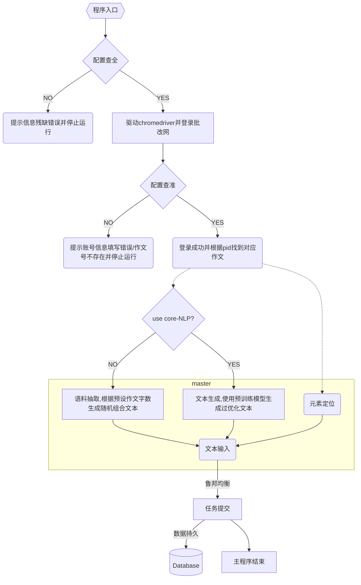

```mermaid
flowchart TB
 work6_1[语料抽取,根据预设作文字数生成随机组合文本]
 work7_1[文本生成,使用预训练模型生成过优化文本]

 work8(元素定位)
 work9(文本输入)

 work1{配置查全}
 input{{程序入口}} --> work1
 work1 --NO--> work1_debug(提示信息残缺错误并停止运行)

 work2[驱动chromedriver并登录批改网]
 work1 --YES-->work2

 work3{配置查准}
 work2 --> work3
 work3 --NO--> work3_debug(提示账号信息填写错误/作文号不存在并停止运行)

 work4(登录成功并根据pid找到对应作文)
 work3 --YES--> work4
 work4 -.-> work5 & work8

 work5{use core-NLP?}
 work5 --YES--> work7_1
 work5 --NO--> work6_1

 subgraph master
 	work6_1 & work7_1 & work8 --> work9
 end

 work9 --鲁邦均衡--> work10[任务提交] --数据持久--> node1[(Database)]
 work10 --> output[主程序结束]
```